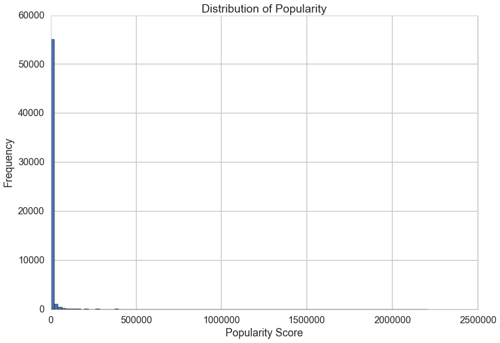
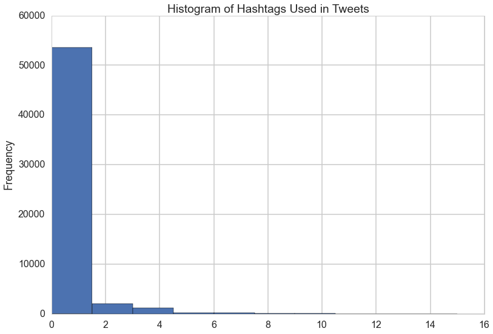
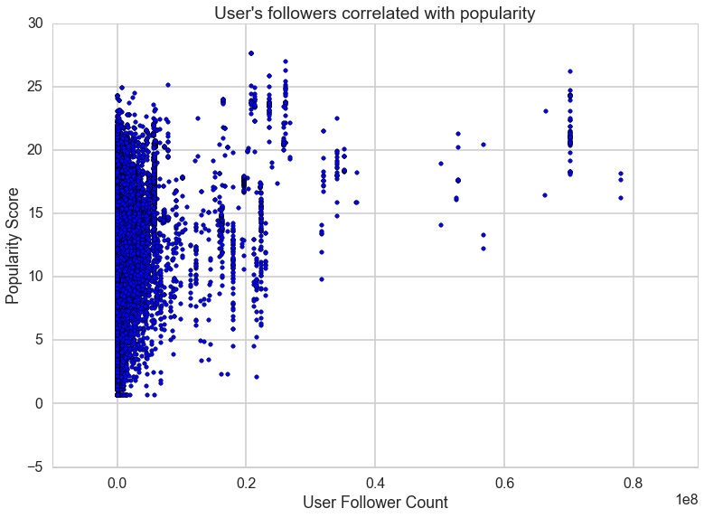

# Predicting Popularity: Using Text and Content Analysis to Examine Shared Characteristics of Popular Posts on Twitter

### A CS109 Final Project by Belinda Zeng, Roseanne Feng, Yuqi Hou, and Zahra Mahmood


## Background and Motivation

Twitter (https://twitter.com) is a social network, real-time news media service, and micro-blogging service where users can use text, photos, and videos to express moments or ideas in 140-characters or less. These 140-character messages are called "tweets.” According to Twitter’s website, millions of tweets are shared in real time, every day. Registered users can read and post tweets, favorite other people’s tweets, retweet other people’s posts, favorite tweets, and follow other accounts. Unregistered users can read tweets from public accounts. 

In today's day and age of Twitter, popularity is measured in hearts, retweets, follows, and follow-backs. What posts get popular over time? What seems to resonate most with people? Do positive or negative sentiments invite more engagement? In this project, we use Twitter's publically available archive of content to  like to examine some of the shared characteristics of popular posts, including length of post, visual content, positivity, negativity.

Our idea came from a desire to understand how movements such as #BlackLivesMatter and #Ferguson begin on Twitter as well as a general desire to know what makes a post popular. We chose to focus on Tweets on an individual level and to use natural language processing to be able to understand and predict what makes posts popular.

One paper that is related to our work is a paper from Cornell titled, [The effect of wording on message propagation: Topic- and author-controlled natural experiments on Twitter](https://chenhaot.com/pages/wording-for-propagation.html), which compaired pairs of tweets containing the same url and written by the same user but employing different wording to see which version attracted more retweets. Twitter itself has published research on [What fuels a Tweet’s engagement?](https://blog.twitter.com/2014/what-fuels-a-tweets-engagement) Their research found that adding video, links and photos all result in an increase in the number of retweets and even breaking down those results by industry. Inspired by previous research, we sought to include sentiment analysis in our understanding of what made a Tweet popular. 

## Objectives

1. How does the distribution of retweets and hearts vary for a post depending on the time of day when the tweet is created?
2. How does positive and negative sentiment affect popularity? 
3. What Tweets do we think will become popular?

## Approach

This data is publicly available via the Twitter Static API that gets queries based on specific parameters. We limited the data set to look at tweets within a specified period of time. We are storing the data in CSV files for now. To reduce file-sizes, we will try to have multiple CSVs so that we don't load too much data into memory. If data exceeds computer memory, we will consider AWS/SQL database alternatives. 

As we can see, the retweet count and favorite count are always 0. This is because we're using the live streaming API and, as a result, we're scraping the tweets as they are tweeted. At this point, all the tweets have retweet count 0 and favorite count 0 since they were literally just posted! That is, unless the tweet posted is actually a retweet... 

To solve the problem of brand new tweets, we used retweets to get the original tweet. This also ensures that our model isn't thrown off when someone with a huge follower count retweets something. Finally, we made sure not to consider the same tweet text twice.

The following function updates the way we use the tweepy streaming API. We first detect if the tweet we're looking at is actually a retweet of something. If so, we then get the original tweet and save that to our csv.

We made sure to only look at English language tweets and unique tweets. 

# Exploratory Analysis

After scraping tweets from the Twitter Streaming API, we use that data to build a feature list that we use to predict how popular an individual tweet will be, measured by a composite score based on the amount of retweets and hearts. We will also use metadata to help us analyze trends in the data, for example if there is a correlation between time of day and retweets.

# Popularity Score

This is the response variable that we are trying to predict using various features of a tweet. The score was originally calculated by adding raw retweet count and favorite counts together, but after some exploratory analysis we chose to z-score retweet and favorite counts.

The distribution of popularity is extremely right-tailed. Later we find that this is explained by the distribution of retweet counts and favorite counts are also extremely right-skewed. 

## Before Transformation


```python

```





## After Transformation

The huge standard deviation and extreme ranges of popularity score suggest that we may need to rethink how we score popularity. We looked more closely at what made up our composite popularity score (favorite count + retweet count) and looked at a statistical summary of retweet count and favorite count to decide if any standardization would be necessary.

We find that the histogram of raw retweet and favorite count appear to have an exponential distribution, so we transformed the data using a log transformation. Since the data was skewed with a disproportionate amount of zeros, a log(1+x) transformation made the most sense to use since, when x=0, log(1)=0. This allowed us to use a log transformation even with the presence of many zeros. The resulting distribution appeared more more normal. 

Given statistics on the transformation on retweet_count and favorite_count, we realize we want to standardize these two for use later on, otherwise since there are way more retweets than favorites, retweets would get weighted more heavily. 

### Create standardized retweet_count and favorite_count 

We decided to use a z-score to standardize retweet counts and favorite counts before adding them together to create the composite popularity score. Using that method, we standardize retweet count and favorites by subtracting the mean and dividing by the standard deviation.


```python

```


## Hashtag Analysis

#### What fraction of tweets in the sample use hashtags?


```python

```





#### Top 10 hashtags 

We make a bar plot of the 10 most commonly used hashtags:


```python

```


### Tweeting about "Popular" Topics and Popularity Score

Even if you're tweeting about a topic (defined in this case as a hashtag that occurs frequently in our sample), it doesn't affect popularity all that much. Therefore, we chose to leave hashtags out of our model because it didn't seem as though hashtags affected our model that much. 


```python

```


    <matplotlib.collections.PathCollection at 0x152393d50>


#### Number of Hashtags vs. Popularity Score


```python

```

    (-0.11968453723056098, 4.1997190814324752e-181)


#### Correlation between presence of links and popularity

Dataframe only has information about links and it would have been too complex to differntiate between images links and other links, so differentiating between images and other urls for this. It appears that having more than one link is correlated with decreased popularity scores. 


```python

```

    (-0.13231394732081603, 3.1358262189471698e-221)


#### Correlation between user mentions and popularity

It appears as though increasing the number of user mentions is correlated with a decrease in popularity score. 


```python

```

    (-0.19074315654104118, 0.0)


#### Correlation for number of retweets and hearts


There generally appears to be a positive correlation between retweet count and hearts. 


```python

```

    (0.93653726046453378, 0.0)


### Location

Originally we had planned to do exploratory analysis on popular topics that people tweet about by city or state, but after taking a look at our data, we found that 3.2% of tweets were geo-tagged, so we ultimately chose to forego this analysis. 

### Post Time

#### When are tweets posted throughout the week?

Because we used the Twitter Streaming API, most of the tweets are posted on a Tuesday, since that's when we scraped the tweets. This is also the case for the spike in tweets posted between midnight and 4am (localized time).


```python

```


#### When are tweets posted during the day?


```python

```


A histogram is helpful, but a polar histogram could possibly visualize our data in a more intuitive way. 


```python

```


#### Correlation between time of day and tweet popularity


There does not appear to be a clear relationship between the time of day that a tweet is created and its popularity score. There does appear to be some cyclical change, but it's hard to tell based on the correlation.


```python

```


 Since there does appear to be a slight relationship, we will include this in the prediction model. 


#### Correlation between day of the week posted and popularity

This appears uniform, more so than hour of the day.


```python

```


#### The distribution of retweets and favorites over time


We were unable to plot this graph using the standardized retweet count so we chose to display the relationship using unstandardized values. 


```python

```


#### User's followers correlated with popularity


```python

```

    (0.23966396888226396, 0.0)





# Sentiment Analysis

#### Determining positive/negative words


Using sentiment lookup dictionaries, score tweets based on how positive/negative they are.

Used a basic list of positive/negative words to begin with, no weights or other information beyond positive/negative. Appears to miss a bunch of tokens (1812/892606 found).

Tried LabMT, using code provided. Rate is a lot better (7016/892606).

Realized number of tokens (892606) was total tokens instead of unique tokens (83093). Still a lot but more tokens found than expected. LabMT is probably the better choice, though.

### Initial Analysis

First we tested the completeness of the lookup dictionaries that we originally chose to score text sentiment. The first positive.txt and negative.txt dictionaries are from UNC. Due to the nature of Twitter, many words and phrases tweeted will not be standard English and it is unlikely that we will find ratings for all of them in our dictionaries. We chose to go with LabMT as our dictionary since it was built for Twitter and therefore contained more words that we looked up. 

We used NLTK to handle much of the text parsing. We also used the NLTK tokenizer which breaks up punctuation and contractions, so words like "can't" are broken up into "ca" "n't", as well as emoticons such as ":)" which become ":", ")". This causes some data to be lost, but ultimately these are neutral or stop words that do not have a significant impact on sentiment.

First, we compiled all the tweets into a format that NLTK could work with...

Then, we looked at how often individual tokens appear and checked to see how many appeared in each of the dictionaries (we are using two dictionaries, the UNC and LabMT one). 

We can see that LabMT found more words so we chose to go with LabMT in our final analysis. Plus, LabMT computes sentiment on a scale whereas the UNC dictionaries were binary. LabMT gave out more information which we thought would be more useful for our model. We also took into consideration that some tokens would not have sentiment ratings, such as the URL tokens or hapaxes, which are tokens that appear only once in our tweets sample.

#### Expectations

A lot of words don't appear in our dictionary, but we think that's okay because many of these are the result of formatting in Tweets that causes the tokenizer difficulty in parsing, or are unique words that are unlikely to throw off our scoring, such as URLs. 

## Sentiment Scoring

Scoring - build columns for scoring text, one on the raw text, one on text that ignores words not in our dictionary, and one that shows us which words are not in the dictionary.

Checking how our lookup and scoring is working.

Sentiment score ranges from approx. -3 to 3, with a mean close to 0.1, or roughly neutral.

Hapaxes (words that appear only once in the Tweets we're analyzing) are a surprisingly large percentage of our tokens (~55000 out of 83000). A lot of them are URLs (19812), which we can probably ignore, or include a Unicode character or formatting that caused the tokenizer to behave oddly. Would it be worth it to try to filter out punctuation, or manually add them to our lookup (ex. replace .!?s with spaces, or add tokens such as '...'. If we add them, how do we generate a score for them?)

## 50 Most Common Tokens

We can look at the fifty most common tokens in our tweets to get an idea of what appears most often. Many of these are punctuation, which generally do not have a consistent effect on sentiment, or are neutral words that do not factor into our sentiment.

# The Ngram Problem

Our approach to sentiment analysis is very simplistic, in large part because we look at words individually. However, in sentences words are not independent of each other and their meanings can combine in different ways to affect the sentiment. For example, the phrase "not bad" would be considered positive, but our sentiment would score it as negative because "not" and "bad" are generally negative. To examine the extent of which this would affect our sentiment scoring, we looked at bigrams and trigrams to understand how often and which bigrams/trigrams could be scored differently than the unigrams. We found that it wasn't a significant enough difference to include them in our analysis.

### Bigrams

We begin by finding the bigrams where the constituent elements are strongly associated with each other, i.e. they often occur together.

### 20 Most Strongly Associated Bigrams

Strongly associated bigrams occur when the elements appear together consistently. For example, if we see a "https" token, the chance that the next token is ":" is high, giving the bigram ("https", ":") a high association score. 

### Token Wrangling

At this point, we remove stopwords and punctuation from our list of tokens in order to see more meaningful tokens in our analysis. 

## Distribution of bigram frequencies


```python

```


## Bigrams vs Unigrams

** Count important bigrams **

These are considered to be bigrams that show up 50 or more times.

** What percentage of our bigrams are important? **

This gives us hope that the presence of bigrams won't throw off our calculations too badly.

** Does manual scoring differ from our unigram scores? **

We manually score the bigrams to see which are positive and negative. Then we do some unigram scoring. Our unigram scores including neutrals. Our unigram scores without neutrals. Our bigramdf now includes manual_ratings, unigram_ratings with neutrals and unigram_ratings without neutrals. Calculate the accuracy of our unigram scoring. 
This shows that our unigram scoring seems pretty accurate since 90% of our manual scoring of bigrams actually match our unigram scores. Now we see if this holds for our no neutrals scoring as wel.

### Trigrams

Now we do the same thing with trigrams.

**Plot distribution of trigram frequencies**


```python

```


## Trigrams vs Unigrams

** Count important trigrams **


As before, the percentage of our trigrams that are important.

**Compare manual and unigram scores of trigrams.**

We followed the same procedure as we did with bigrams. Again, we realize that our unigram scoring seems pretty accurate. 

### Unigram, Bigram, Trigram comparison


```python

```


    <matplotlib.legend.Legend at 0x143237d10>


```python

```


    <matplotlib.text.Text at 0x1591c9f90>


# Prediction

Working on prediction. Note: HW5 prediction is used to predict if sentiment is positive or negative, but we want to use this to predict how popular something is, not sure how to do that. Xarray below was built on text, but we should probably be doing something like HW2 and using sentiment or sentimentnoneutrals as one of the factors instead. I have been doing too much text analysis.

We model popularity as a function of features of the tweet and the user that posted it. Hashtags, links, mentioned users, sentiment, and time of posting are all features that can affect how many people see the tweet and the likelihood of a user retweeting and thus expanding the number of users who see the tweet. We also use the poster's follower count as a feature to account for users whose higher follower counts means that their initial audience is larger to begin with and can skew their popularity score compared to users with lower follower counts.

Preliminary test on a basic OLS regression model we have fairly low R^2. It's possible to run the following code to see if there's just something wrong in our formula (i.e. can we get a higher R^2 with a different combination of features), but it's likely that all our results are going to have a low R^2 by the nature of the problem.

## Prediction Results


```python

```


## Limitations

We have several limitations to this study. 

- Data sample bias. Even though we scraped the tweets randomly, our sample is biased towards a specific time period, namely Tuesdays. This is because our tweets were originally scraped through the streaming API on a Tuesday. Though we filter the tweets looking for retweets and then only inputting the original tweet from that retweet into our data set, this causes a bias for our tweets to come primarily from Tuesdays, or even Monday and Wednesdays.
- outliers for max size

## Future Work

- Character Length and Emojiis, we didn't take out emojiis

- We can also use 0 - inflated poisson

- Naive Bayes Classifier 

- Time zone - seeing if local time vs universal time has an effect


